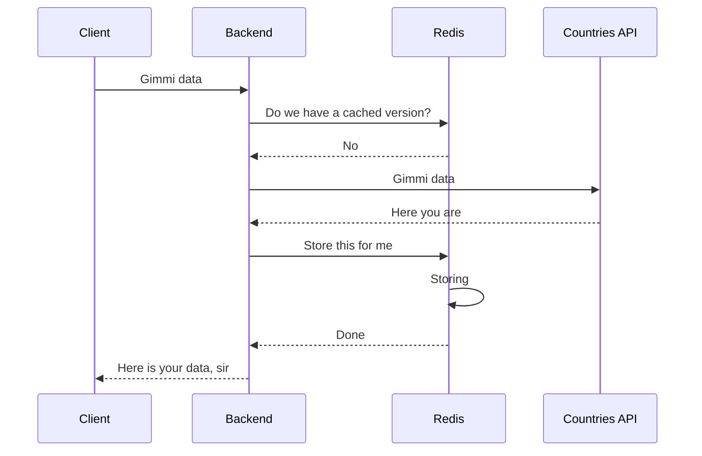
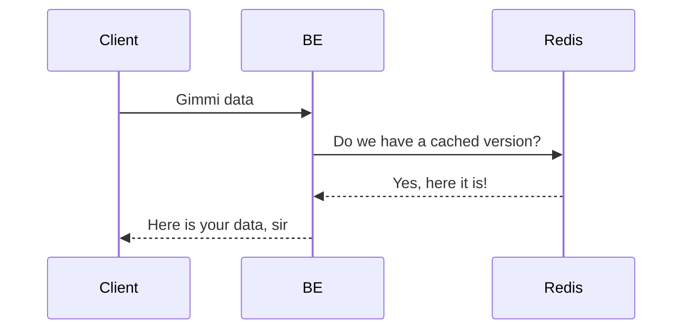

# Backend for Frontend course, BE part, project 1

## Redis setup

Start a redis via docker

```bash
docker run -dit --rm --name=my-redis -p 6379:6379 redis:6.0.8
```

To run redis commands directly to DB:

```bash
docker exec -it my-redis redis-cli
```

To stop redis container

```bash
docker stop my-redis
```

Check the [redis](https://www.npmjs.com/package/redis) npm package Docs.

## Redis idea

When there is no cache yet for a specific request



In case we already have a cached data



## How to kill the process on a specific port

In case we cannot run the node app on a specific port:

```bash
lsof -i :3000

kill -9 <PID>
```